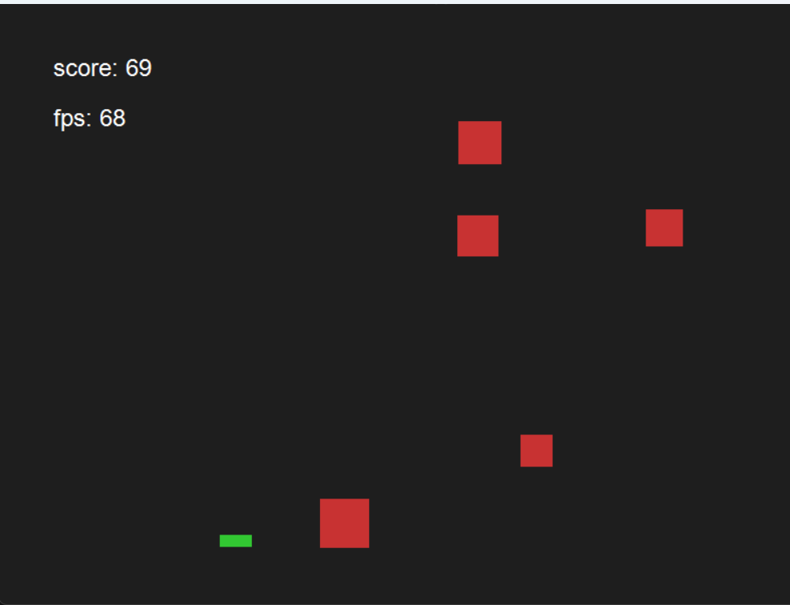
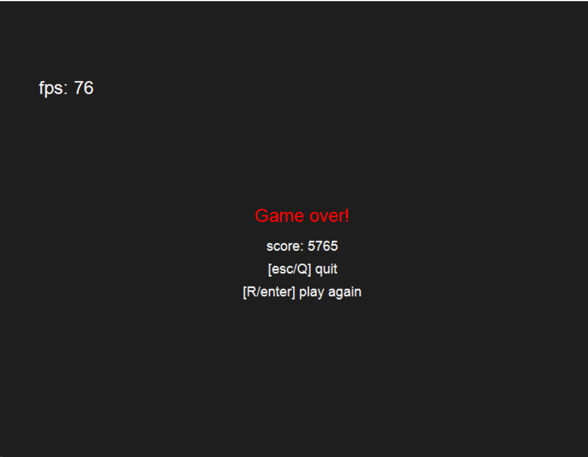

# Dodge the Falling Blocks

A small 2D dodge game written in C++ using the native Win32 API and GDI+.

The player controls a block near the bottom of the window and must avoid falling blocks for as long as possible. The game becomes progressively harder as time passes.

## Screenshots

### Gameplay



### Gameover



## Features

* Native Windows desktop application using Win32
* 2D rendering using GDI+
* Real-time game loop using delta time
* Player movement with keyboard input
* Randomly generated falling blocks
* AABB collision detection
* Score system
* Increasing difficulty over time
* Game Over state
* Restart functionality
* FPS counter
* Back-buffer rendering

## Gameplay

The player starts near the bottom of the window.

Falling blocks are generated at random horizontal positions and move downward. The player must move left and right to avoid collisions.

The difficulty increases over time:

* Falling blocks gradually become faster.
* New blocks spawn more frequently.
* Surviving increases the player's score.

The game ends when a falling block collides with the player.

## Controls

| Key                 | Action                  |
| ------------------- | ----------------------- |
| `A` / `Left Arrow`  | Move left               |
| `D` / `Right Arrow` | Move right              |
| `R`                 | Restart after Game Over |
| `Enter`             | Restart after Game Over |
| `Q` / `Escape`      | Quit                    |

## Architecture

The project is divided into several main components:

```text
Application
├── Window
├── Renderer
├── InputMap
├── FpsCounter
└── Game
    └── GameData
```

### Application

Responsible for coordinating the main systems and running the game loop.

The main loop performs:

1. Windows message processing
2. Delta-time calculation
3. Input handling
4. Game update
5. Rendering

### Window

Contains the Win32-specific window code.

Responsibilities include:

* Creating the application window
* Registering the Win32 window class
* Processing Windows messages
* Handling keyboard input
* Closing the application

### InputMap

Provides a simple abstraction between Win32 keyboard events and game input.

The game works with states such as:

* `moveLeft`
* `moveRight`
* `replay`
* `quit`

rather than directly handling Win32 messages.

### Game

Contains the gameplay and simulation logic.

Responsibilities include:

* Player movement
* Block spawning
* Block movement
* Collision detection
* Score updates
* Difficulty progression
* Game Over handling
* Restarting the game

### GameData

Stores the current gameplay state, including:

* Player data
* Falling blocks
* Score
* Gravity/falling speed
* Spawn timing
* Current game state

### Renderer

Responsible for drawing the game using GDI+.

It renders:

* Background
* Player
* Falling blocks
* Score
* FPS
* Game Over screen

The renderer uses a back buffer before copying the rendered image to the window.

### FpsCounter

Measures the approximate current frame rate and displays it during gameplay.

## Project Structure

```text
.
├── include/
│   ├── application.hpp
│   ├── draw_text_info.hpp
│   ├── error_util.hpp
│   ├── fps_counter.hpp
│   ├── game.hpp
│   ├── game_data.hpp
│   ├── input_map.hpp
│   ├── renderer.hpp
│   └── window.hpp
│
├── src/
│   ├── application.cpp
│   ├── error_util.cpp
│   ├── fps_counter.cpp
│   ├── game.cpp
│   ├── main.cpp
│   ├── renderer.cpp
│   └── window.cpp
│
├── build/
│   └── block_dodge.exe
│
├── CMakeLists.txt
└── assignment.md
```

## Requirements

This project currently targets Windows and requires:

* Windows
* A C++ compiler with C++20 support
* CMake 4.4.3 or newer
* GLM 1.0.3
* GDI+ (included with Windows)

GLM need to be installed/configured so that CMake can find them with `find_package()`.

## Building

Clone the repository:

```bash
git clone https://github.com/AaronK9005/Dodge-block.git
cd Dodge-block
```

Configure the project with CMake:

```bash
cmake -S . -B build
```

Build it:

```bash
cmake --build build --config Release
```

The generated executable will be placed in the build output directory.

## Running

Run the generated executable:

```text
block_dodge.exe
```

On Windows, the repository also contains a built executable in:

```text
build/block_dodge.exe
```

## Development Notes

The game simulation uses delta time (`dt`) so that movement and gameplay are not directly tied to the number of rendered frames.

The application uses a custom main loop rather than relying on `WM_PAINT` for continuous rendering, which is appropriate for the real-time nature of the game.

## Version

Current version:

**v1.0.2**

## Assignment

This project was created as a C++ Windows game assignment focused on:

* Win32 programming
* Object-oriented C++
* Input handling
* 2D rendering
* Game loops
* Collision detection
* Random generation
* Basic game architecture
